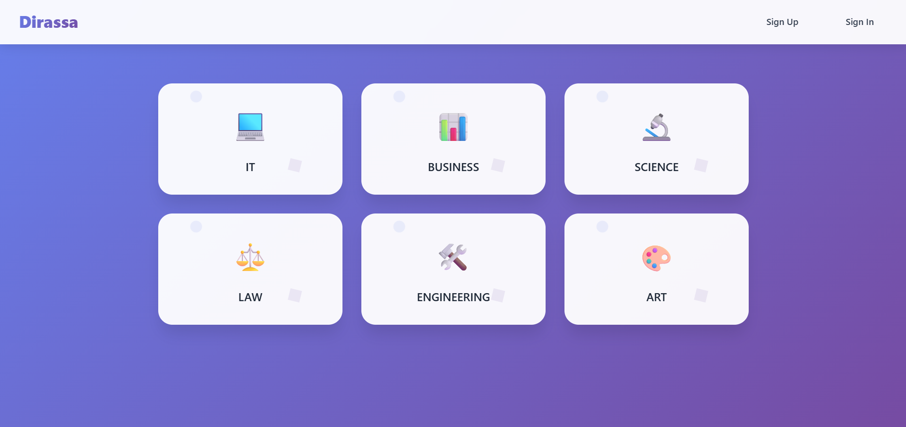

# Dirassa



Dirassa is a web application designed to help students discover and explore academic resources. Users can browse notes under a specific college, view details, and stay updated on related events. Our platform provides an intuitive and interactive experience, helping students stay organized and connected within their academic community.


---

## Getting Started


- **Deployed App:** [View Dirassa Online](https://dirassa-front-end.vercel.app/)  
- **Planning Materials:** [View Planning Docs](https://trello.com/b/1ij8wTIg/project-4)  
- **Back-End Repository:** [View Back-End Code](https://github.com/Yusuf-qamber/Dirassa-backend)

---

## Technologies Used

- JavaScript 
- React
- SCSS 
- Node.js
- Express.js
- Heroku
- Mongodb

---
## Dependencies

```JSON
  "dependencies": {
    "mapbox-gl": "^3.14.0",
    "react": "^19.1.0",
    "react-dom": "^19.1.0",
    "react-icons": "^5.5.0",
    "react-map-gl": "^7.1.7",
    "react-router-dom": "^7.7.1"
  }
  ```
## Attributions

- [Google Fonts](https://fonts.google.com/) 
<!-- - [react Icons](https://www.google.com/search?q=react+icons&ie=UTF-8) -->
- [Mapbox](mapbox.com)

---

## Next Steps

- Adding the option to sign up or sign in with Google
- Adding a like button for each note and event
- Improving mobile responsiveness
- Adding a search bar for easier searching
- Adding a live chat section
- Adding a lost and found feature
- Adding a schedule planner
- Adding a GPA calculator
- Allowing users to upload files from their local devices
- Adding Cloudinary to allow users to upload images


## Landing Page

